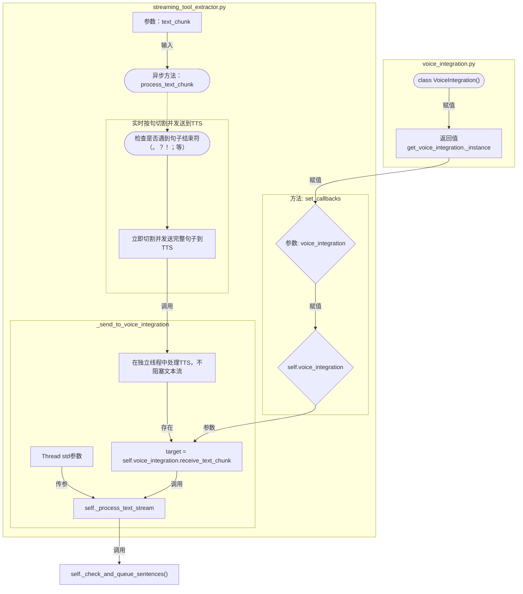

## 流程图

```mermaid
flowchart
    subgraph voice_integration.py
        I(["class VoiceIntegration()"]) -- 赋值 --> J[返回值get_voice_integration._instance]
    end
    J -- 赋值 --> G
    subgraph streaming_tool_extractor.py
        A[参数：text_chunk] -- 输入 --> B([异步方法：process_text_chunk]) -.-> C([检查是否遇到句子结束符（。？！；等）])
        subgraph 实时按句切割并发送到TTS
            C --> D[立即切割并发送完整句子到TTS]
            end
        subgraph "_send_to_voice_integration"
            D -- 调用 --> E[在独立线程中处理TTS，不阻塞文本流] -- 存在--> F[target = self.voice_integration.receive_text_chunk]
            L[Thread std参数] -- 传参 --> K
            end
        subgraph "方法: set_callbacks"
            G{参数: voice_integration} -- 赋值 --> H{self.voice_integration}
            end
        H -- 参数 --> F
    end
    F -- 调用 --> K[self._process_text_stream]
    K -- 调用 --> M["self._check_and_queue_sentences()"]
```
