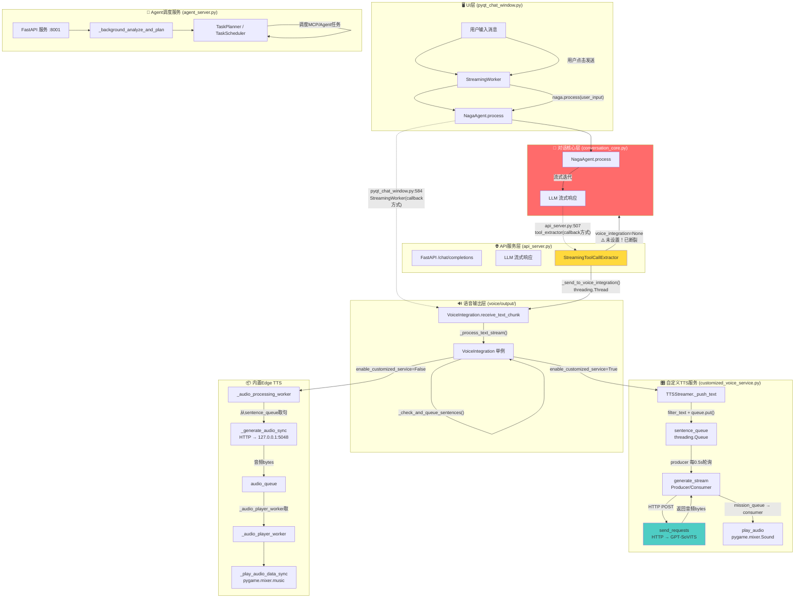

# TTS 工作流程分析：从 AgentServer 到 VoiceIntegration

## 总体架构



## 两条TTS数据流路径

### 路径1: UI → NagaAgent → 回调方式

```
pyqt_chat_window.py
  └─ StreamingWorker.__init__()                         # enhanced_worker.py:144
       └─ self.voice_integration = get_voice_integration()  # :32 获取单例
       └─ self.tool_extractor = StreamingToolCallExtractor() # :167
       └─ self.tool_extractor.set_callbacks(               # :168
            on_text_chunk=self._on_text_chunk_sync,         # 回调: 发送文本到UI + VoiceIntegration
            on_sentence=self._on_sentence_sync,             # 回调: 空操作
            on_tool_result=self._on_tool_result_sync)       # 回调: 发送工具结果到UI

StreamingWorker.process_with_progress()                   # :240
  └─ async for chunk in naga.process(user_input):         # :258
       └─ tool_extractor.process_text_chunk(content_str)  # :273
            └─ _on_text_chunk_sync(chunk) 被回调           # :196
                 └─ voice_integration.receive_text_chunk(text)  # :207 via thread
```

### 路径2: API Server → 直接TTS切割

```
api_server.py /chat/completions (流式)                    # :430
  └─ StreamingToolCallExtractor(naga_agent.mcp)            # :433
  └─ voice_integration = get_voice_integration()           # :443
  └─ tool_extractor.set_callbacks(                         # :451
       on_text_chunk=callbacks['on_text_chunk'],           # → 推送到前端
       voice_integration=voice_integration)                # → 设置TTS引用

  LLM流式响应循环:                                         # :492
    └─ tool_extractor.process_text_chunk(content)          # :507
         └─ 按句切割 (句末标点检测)                        # streaming_tool_extractor.py:94
         └─ _send_to_voice_integration(complete_sentence)  # :102
              └─ voice_integration.receive_text_chunk(sentence)  # :123 via thread
```

---

## TTS服务失效原因分析

### 🔴 问题1: pygame vendor 模块不存在 (已在上次修复)

**文件:** `voice/output/voice_integration.py` (行 95, 303, 342)

原代码 `import nagaagent_core.vendors.pygame as pygame` 指向一个不存在的 vendor wrapper。
venv中pygame已安装于 `.venv/Lib/site-packages/pygame/`，需直接 `import pygame`。

**影响:** `_init_pygame_audio()` 和 `_audio_player_worker()` 初始化失败，导致 `pygame_available=False`，音频无法播放。

**状态:** ✅ 已修复（上次编辑）

---

### 🔴 问题2: `set_callbacks()` 签名不匹配 (已在上次修复)

**文件:** `apiserver/streaming_tool_extractor.py:80`

原方法仅接受 `on_text_chunk` 和 `voice_integration`，但 `enhanced_worker.py:168` 和 `conversation_core.py:744` 传入额外的 `on_sentence`、`on_tool_result`、`tool_call_detected_signal` 等参数导致 `TypeError`。

**状态:** ✅ 已修复（上次编辑）

---

### 🔴 问题3: UI路径中 `voice_integration` 未传入 `tool_extractor` (核心断裂点)

**文件:** `ui/enhanced_worker.py:168`

`StreamingWorker.__init__()` 中调用 `set_callbacks()` 时**缺少 `voice_integration` 参数**:

```python
# ❌ 原代码 — 未传入 voice_integration
self.tool_extractor.set_callbacks(
    on_text_chunk=self._on_text_chunk_sync,
    on_sentence=self._on_sentence_sync,
    on_tool_result=self._on_tool_result_sync,
    tool_call_detected_signal=self.tool_call_detected.emit
    # voice_integration 缺失！
)
```

对比 `api_server.py:451` 正确传入了 `voice_integration=voice_integration`。

**断裂链:**
1. `process_text_chunk()` 检测到完整句子 → 调用 `_send_to_voice_integration(sentence)`
2. `_send_to_voice_integration()` 检查 `if self.voice_integration:` → **None → 直接返回**
3. 文本被静默丢弃，永远不会到达 `VoiceIntegration.receive_text_chunk()`
4. 因此 `TTSStreamer._push_text()` 也永远不会被调用

**状态:** ✅ 已修复（添加 `voice_integration=self.voice_integration`）

---

### 🟡 问题4: threading.Queue 在 async 上下文中的阻塞风险

**文件:** `voice/output/customized_voice_service.py:245-246`

原代码在 async producer 中使用 `threading.Queue.get()`（同步阻塞调用），如果队列在 `empty()` 和 `get()` 之间变空，会阻塞整个 asyncio 事件循环。

**修复:** 改用 `get_nowait()` + `except Empty: break` 非阻塞排空模式，同时修复了 `i=0` 导致的日志序号始终为 1 的 bug。

**状态:** ✅ 已修复

---

### 🟡 问题5: VoiceIntegration.text_buffer 线程不安全

**文件:** `voice/output/voice_integration.py:138-147`

`receive_text_chunk()` 被多线程并发调用，对 `self.text_buffer` 的读写无锁保护。

**修复:**
- 添加 `self._text_lock = threading.Lock()` 保护锁
- 将句子检测逻辑提取为 `_check_and_queue_sentences_locked()` 内部方法
- `_process_text_stream()`、`finish_processing()`、`reset_processing_state()` 均通过锁保护 `text_buffer` 访问

**状态:** ✅ 已修复

---

### 🟡 问题6: 自定义TTS路径中 _audio_player_worker 空转

**文件:** `voice/output/voice_integration.py:65-84`

原代码无论哪种模式都启动 `_audio_player_worker`，但在自定义TTS模式下 `audio_queue` 永远为空（TTSStreamer自己播放），播放线程在 `audio_queue.get(timeout=30)` 上永久空等。

**修复:**
- 内置模式：调用 `_start_builtin_workers()` 启动播放和处理两个线程
- 自定义模式：不启动播放线程，TTSStreamer 自行处理播放
- 自定义启动失败回退时：也调用 `_start_builtin_workers()` 正确启动两个线程

**状态:** ✅ 已修复

---

### 🟡 问题7: 自定义TTS路径无降级机制

原代码自定义TTS失败时只捕获异常返回 `None`，生产者静默跳过。

**修复:**
- 新增 `_consecutive_failures` 连续失败计数器，成功时归零
- 新增 `_warn_if_too_many_failures()` 方法，连续失败 ≥5 次时输出醒目警告
- 初始化时的降级路径已完善（启动 `generate_stream` 失败时回退到内置模式）

**状态:** ✅ 已修复

---

## 配置路径

| 配置项 | 默认值 | 说明 |
|--------|--------|------|
| `config.system.voice_enabled` | `True` | 语音功能总开关 |
| `config.tts.enable_customized_service` | `False` | 自定义TTS vs 内置Edge TTS |
| `config.tts.voice_config_filename` | `"config"` | 自定义TTS配置文件（当前使用 `"Dandelion"`） |
| `config.tts.port` | `5048` | 内置Edge TTS端口 |
| Dandelion.json `curl` | `http://127.0.0.1:9880/tts` | 自定义TTS端点 |

---

## 排查步骤

1. **确认自定义TTS服务状态:** `curl http://127.0.0.1:9880/tts`
2. **确认参考音频存在:** 检查 `D:\GPT-SoVITS\Material\Dandelion(ja)\...` 路径
3. **如不需要自定义TTS:** 设置 `enable_customized_service=False` 使用内置Edge TTS
4. **检查pygame:** `python -c "import pygame; pygame.mixer.init()"`
