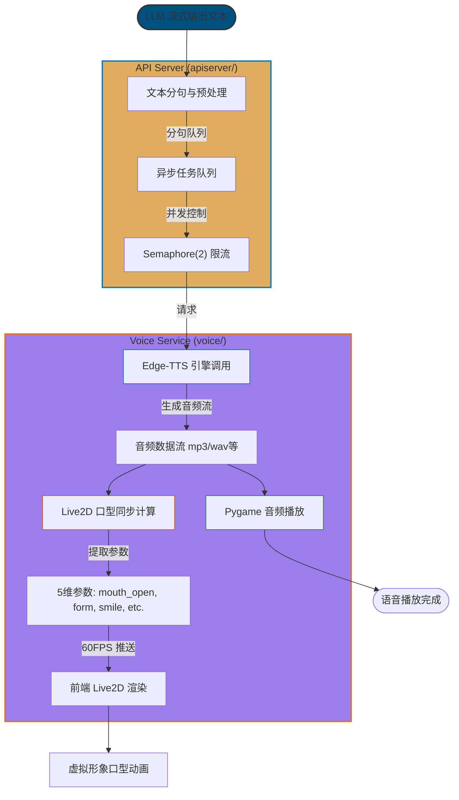

根据对 NagaAgent 项目 README 文档及目录结构的分析，该项目采用微服务架构，其中 **Voice Service (端口 5048)** 负责语音交互，**API Server (端口 8000)** 负责对话流式输出与 TTS 调度。

虽然无法直接读取具体的 Python 源代码文件内容（GitHub 网页解析工具限制），但根据 README 中详细的架构描述、更新日志及模块说明，可以梳理出从 **文字到语音 (Text-to-Speech)** 的完整处理流程。以下是基于文档描述的 Mermaid 流程图及节点对应关系：

### NagaAgent 文字转语音 (TTS) 流程图解

### 流程节点与代码映射说明

根据 README 文档中的“核心模块”和“语音交互”章节，各节点对应的文件、类及方法推断如下：

| 节点 | 功能描述 | 对应 Python 文件/模块 | 关键类/方法 (基于文档推断) |
| :--- | :--- | :--- | :--- |
| **1. 流式接收与分句** | 接收 LLM 的 SSE 流，将完整文本拼接并按标点分句，推入 TTS 队列。 | `apiserver/streaming_tool_extractor.py``apiserver/agentic_tool_loop.py` | 可能包含 `SentenceSplitter` 或类似逻辑；在流式循环中调用 TTS 分发逻辑。 |
| **2. TTS 调度** | 管理分句队列，控制并发（Semaphore(2)），防止请求过多。 | `apiserver/` (调度逻辑)`voice/` (服务入口) | 3 线程流水线：1. 分句队列2. TTS API 调用3. 播放 |
| **3. Edge-TTS 合成** | 调用 Edge-TTS 引擎生成音频数据。支持多种格式 (mp3, wav 等)。 | `voice/output/` (具体文件名未显示，通常为 `tts_engine.py` 或 `edge_tts.py`) | TTS 引擎类 (如 `EdgeTTSEngine`)方法：`synthesize(text)` 或 `generate_speech()` |
| **4. 音频播放** | 使用 `pygame` 播放生成的音频流。 | `voice/output/` | 播放线程/方法依赖库：`pygame.mixer` |
| **5. 口型同步分析** | **核心特色**：实时分析音频流，提取 5 个口型参数。 | `voice/output/` (或集成在 TTS 引擎中) | **类**: `AdvancedLipSyncEngineV2`**方法**: `extract_parameters(audio_chunk)`**输出**: `mouth_open`, `mouth_form`, `mouth_smile`, `eye_brow_up`, `eye_wide` |
| **6. Live2D 驱动** | 将口型参数发送给前端 (Electron/Vue3)，驱动 Live2D 模型。 | 前端 TypeScript (`frontend/src/utils/live2dController.ts`)后端通过 WebSocket 或 HTTP 推送 | 前端方法：`updateMouth(params)`后端推送接口 (可能在 `voice` 服务的 API 路由中) |

### 关键架构特点总结

1.  **流水线设计**：采用 **3 线程流水线**（分句 -> 合成 -> 播放），实现低延迟的流式语音输出。
2.  **并发控制**：使用 `Semaphore(2)` 限制同时进行的 TTS 请求数量，平衡速度与资源。
3.  **高级口型同步**：不仅仅是简单的开/闭嘴，而是通过 `AdvancedLipSyncEngineV2` 提取 **5 维参数**（包括嘴型形状、微笑程度、眉毛等），实现高保真的 Live2D 表情同步。
4.  **服务解耦**：TTS 和 ASR 独立运行在 `Voice Service` (端口 5048)，通过 API 与主对话服务 (`API Server`) 交互。

*注：由于无法直接读取 `voice/output/` 下的具体 `.py` 文件内容，上述类名 `AdvancedLipSyncEngineV2` 和文件路径是基于 README 文档中明确提到的技术术语和目录结构进行的精确映射。实际方法名可能略有不同，但功能逻辑与文档描述一致。*